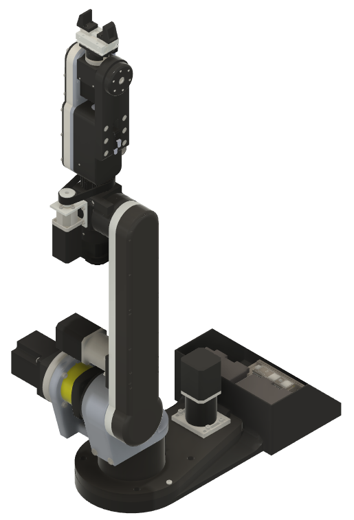
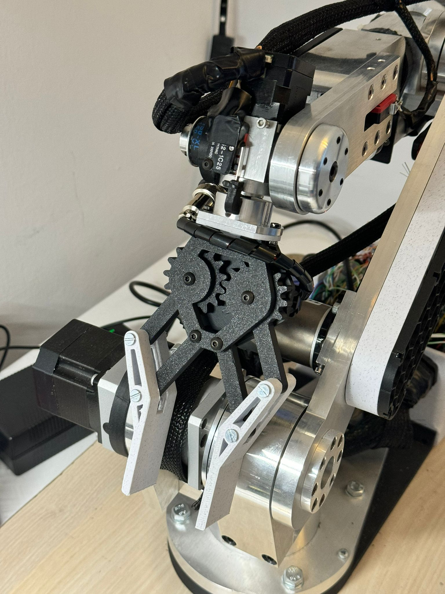

# SmartifyBot - Braț Robotic cu 6DOF


  

  **Categorie: Seniori**
  
  **Mutică Tudor-Gabriel**

  **Colegiul Național "Ferdinand I", Bacău**

  **Profesor coordonator:**
  **Întuneric Ana, Colegiul Național
  "Ferdinand I", Bacău**

  **Introducere**
---

> SmartifyBot este un sistem robotic avansat, conceput pentru a răspunde
> provocărilor diverselor domenii aplicate, inclusiv reciclarea
> PET-urilor, gravarea și tăierea materialelor, imprimarea 3D și
> manipularea obiectelor și substanțelor periculoase. Acest robot
> industrial cu braț articulat pe 6 grade de libertate (DOF) integrează
> inteligența artificială și controlul vocal, oferind o soluție
> versatilă și eficientă pentru sarcini automate în medii de producție
> și alte aplicații industriale, dar și pentru asistența casnică.
>
> 

**Scopul Proiectului**

> Scopul principal al SmartifyBot este de a îmbunătăți eficiența
> proceselor industriale și de reciclare prin:

-   **Eficiența Operațională:** Optimizarea proceselor de manipulare și
    > reciclare, reducând timpul și costurile.

-   **Flexibilitatea și Adaptabilitatea:** Crearea unei platforme
    > versatile care poate fi configurată pentru diferite sarcini, cum
    > ar fi asamblarea, tăierea și gravarea materialelor.

-   **Interacțiunea Intuitivă:** Integrarea unui sistem de comandă
    > vocală și a unei interfețe grafice ușor de utilizat.

-   **Operare la Distanță:** Permite controlul și monitorizarea de la
    > distanță pentru utilizare în medii periculoase sau inaccesibile
    > prin RDC (Remote Desktop Connection).

-   **Inovare Tehnologică:** Implementarea de tehnologii avansate,
    > inclusiv module de imprimare 3D și laser.

```{=html}
<!-- -->
```
-   **Dezvoltarea Brațului Robotic Autonom:** Crearea unui sistem
    > capabil să opereze independent.

-   **Îmbunătățirea Reciclării:** Optimizarea procesului de reciclare
    > prin tehnologie avansată.

-   **Colaborarea cu Specialiști:** Parteneriate pentru îmbunătățirea
    > proceselor de reciclare.

-   **Extinderea Funcționalităților:** Dezvoltarea de module
    > suplimentare pentru diverse aplicații.

> 
> 
> 
> 

**Problema Identificată**

> Reciclarea PET-urilor este adesea costisitoare și dificilă, în special
> în ceea ce privește sortarea manuală după culori. SmartifyBot
> abordează această problemă prin automatizarea sortării PET-urilor și
> extinde funcționalitatea sa pentru alte aplicații
> industriale.
> 

> Brațul robotic cu 6DOF și capul modular permit execuția sarcinilor
> complexe precum gravarea, imprimarea 3D și manipularea obiectelor,
> toate integrate cu inteligență artificială pentru recunoaștere și
> adaptare în timp
> real.

**Metode Folosite**

> Scopul principal al SmartifyBot este de a îmbunătăți eficiența
> proceselor industriale și de reciclare prin:

1\. **Proiectarea Brațului Robotic**

> **CAD și Modelare 3D:** Am folosit software-ul Fusion 360 pentru
> proiectarea brațului robotic și a modulelor. Modelarea a inclus
> aspecte de performanță și integrare a componentelor.


> **Cinematică Inversată:** Am implementat cinematică inversă pentru a
> calcula mișcările necesare articulațiilor pentru a atinge poziții și
> orientări specifice ale endeffector-ului.
>
> **Materiale și Componente:** Piesele structurale sunt realizate din
> aluminiu prelucrat la CNC, iar alte componente sunt printate 3D din
> PLA. Articulațiile utilizează motoare stepper cu gearbox, encoder și
> limit switch, folosind curele și tijă filetată pentru transformarea
> mișcării verticale în mișcare rotativă.


2\. **Partea Electronică**

> **Controlul Articulațiilor:** Controlul mișcării celor șase
> articulații ale robotului se realizează prin intermediul unei plăci
> Teensy 4.1. Aceasta nu doar că gestionează accelerarea mișcărilor și
> calculează cinematică inversată, dar se ocupă și cu traiectorii
> complexe precum spline-uri și orbit-uri.
>
> Placa Teensy 4.1 este conectată la driverele stepper pentru motoare,
> la encodere pentru monitorizarea poziției și la limit switch-uri
> pentru prevenirea depășirii limitelor de mișcare, asigurând astfel o
> funcționare precisă și sigură a robotului.
>
> 
> 
> 
>
> **Module Separatoare:** Modulele de imprimare 3D, gravare și
> manipulare sunt \`te cu circuite electronice separate. Modulul gheară
> este acționat de un motor servo, controlat de un Arduino Mega care
> permite integrarea de senzori suplimentari și motoare
> adiționale.

**!!!Alimentarea este făcută de cadre o sursa de 24V si 11A!!!**

3\. **Integrarea Inteligenței Artificiale**

> **Recunoașterea și Sortarea:** Am utilizat algoritmi de învățare
> automată și tehnologia YOLO pentru recunoașterea și clasificarea
> PET-urilor. AI-ul este antrenat pe seturi de date relevante pentru a
> asigura o sortare precisă și
> eficientă.
> **Antrenarea AI:** Utilizarea seturilor de date de pe GitHub și
> ajustarea parametrilor pentru optimizarea recunoașterii materialelor.

4\. **Simularea și
Testarea**

> **Simulare în Unity:** Am dezvoltat o simulare în Unity pentru
> testarea mișcărilor brațului robotic și identificarea problemelor
> într-un mediu virtual înainte de implementarea fizică.
>
> **Testarea Componentelor:** Testarea și evaluarea componentelor
> electronice pentru a asigura performanța și fiabilitatea acestora.

5\. **Software și Interfață**

> **Interfață Grafică:** Software-ul include o interfață grafică
> intuitivă care facilitează programarea și controlul robotului,
> inclusiv rularea de comenzi G-Code pentru gravare și imprimare 3D.


> **Comandă Vocală:** Integrarea unui asistent virtual pentru controlul
> vocal al brațului robotic, permițând rularea de acțiuni și comenzi
> fără contact
> fizic.

> **Programare Secvențială:** Software-ul permite rularea de comenzi
> secvențiale, loop-uri și diverse tipuri de mișcări, inclusiv liniare,
> spline-uri și orbit-uri.
>
> **Vision System:** Utilizarea unei camere Logitech C920 pentru
> detectarea și sortarea PET-urilor pe baza culorii și a altor
> caracteristici vizuale.
>
> 

6\. **Autocalibrarea Sistemului de Vision**

> Un aspect esențial al SmartifyBot este capacitatea sa de a funcționa
> autonom în medii necunoscute, fără intervenția umană directă. Acest
> lucru este realizat printr-un sistem de viziune avansat care include
> funcționalitatea de autocalibrare. Iată cum se realizează acest
> proces:

**6.1. Componentele Sistemului de Vision**

> Software de Procesare a Imaginilor: Algoritmi și modele de inteligență
> artificială care analizează și interpretează imaginile capturate de
> cameră.
>
> **6.2. Procesul de Autocalibrare**
>
> Autocalibrarea permite robotului să ajusteze automat parametrii
> sistemului său de viziune pentru a se adapta la condiții variabile și
> necunoscute. Iată pașii principali ai acestui proces:


> **6.2.1. Inițializarea și Capturarea Imaginilor de Referință:**
>
> Capturarea Imaginilor de Start: La început, robotul capturează imagini
> de referință din mediu. Aceste imagini sunt folosite pentru a stabili
> un cadru de bază pentru toate ajustările ulterioare.
>
> Detectarea și Analiza Mediului: Camera analizează caracteristicile
> ambientale, inclusiv variațiile de iluminare, contraste și texturi.
>
> **6.2.2. Detectarea și Corectarea Erorilor:**
>
> Detectarea Deformărilor și Distorziunilor: Algoritmii de procesare a
> imaginilor identifică distorsiunile care ar putea afecta precizia
> sistemului de viziune. Aceste distorsiuni pot fi cauzate de unghiuri
> de vizualizare inadecvate sau schimbări în condițiile de iluminare.
>
> Calculul și Aplicarea Corecțiilor: După identificarea distorsiunilor,
> sistemul calculează parametrii de corecție, inclusiv ajustarea
> distanței focale, a poziției și a unghiului camerei, și aplică aceste
> corecții automat.
>
> **6.2.3. Ajustarea Dinamică a
> Parametrilor:**
>
> Adaptarea la Condiții Schimbătoare: Sistemul monitorizează în
> permanență condițiile de iluminare și alte variabile de mediu,
> ajustând parametrii de captură a imaginii pentru a menține o calitate
> constantă.
>
> **6.2.4. Validarea și Testarea Autocalibrării:**
>
> Testare Periodică: Robotul efectuează teste periodice pentru a valida
> corectitudinea calibrării, asigurându-se că ajustările sunt încă
> valide și că performanța sistemului este optimă.
>
> Actualizarea Algoritmilor: Algoritmii sunt actualizați periodic pentru
> a integra noi tehnici de procesare a imaginilor și pentru a răspunde
> la variațiile complexe ale mediului.

**Beneficiile Autocalibrării**

Independență: Robotul nu necesită intervenție umană pentru ajustarea
parametrilor de viziune, ceea ce îl face ideal pentru medii necunoscute
și schimbătoare.

Precizie Îmbunătățită: Prin corectarea automată a erorilor, sistemul de
viziune menține o precizie ridicată în recunoașterea și manipularea
obiectelor.

Eficiență Operațională: Autocalibrarea reduce timpul necesar pentru
pregătirea și configurarea robotului, permițându-i să înceapă lucrul mai
repede și să se adapteze la schimbări în mediu.

**Rezultate și Concluzii**

> **SmartifyBot** a demonstrat o performanță excelentă în sortarea
> PET-urilor cu o precizie ridicată, chiar și în condiții de lumină
> nefavorabilă. Sistemul robotic a funcționat eficient, îmbunătățind
> semnificativ procesul de reciclare și oferind soluții inovatoare
> pentru diverse aplicații industriale. Prin integrarea tehnologiilor
> avansate și a unui control intuitiv, SmartifyBot reprezintă un pas
> important în automatizarea industrială și reciclarea eficientă.



